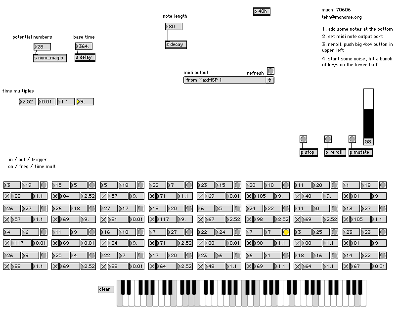

# muon

emergent feedback sequencer

created by: tehn

(initially constructed as a demo at the machine project’s most recent max/msp workshop.)

muon is a algorithmic sequencer in a sense, though better described as emergent:

wiki: http://en.wikipedia.org/wiki/Emergence

each voice is looking for a magic number. if it matches one, it will trigger it’s sound, wait a specified interval, then transmit it’s own magic number to the rest of the voices. so each voice has two numbers: that it’s looking to match (input) and that which it sends (output).

all of this is can (and should) be randomized.

what’s interesting is when the network creates feedback loops. often several at once, of different lengths, hence polyrhythms. several different delay multipliers are allowed.

furthermore, there is a “mutate” feature, which randomizes only by probability. by default this is at 15 percent, so when mutate is called, each parameter of each voice has only 15% chance of re-rolling itself.

## Instructions

some other features not documented or in the vid:

* hold down re-roll (top left 4×4) then press lower voices to mute/unmute them
* hold down mutate (top right 4×4) then press lower voices to only mutate that voice
* push top two big 4×4’s together to stop everything

if you don’t have a midi softsynth of choice, try simplesynth

http://vimeo.com/704818